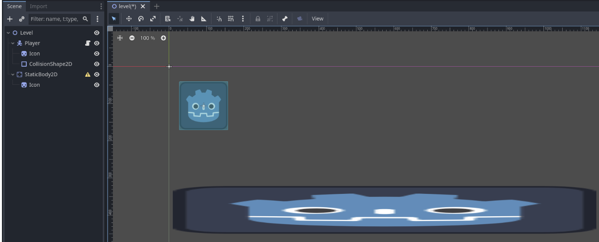

# GameDev

- [GameDev](#gamedev)
- [Overview](#overview)
- [Demos](#Demos)
- [Workshop Objectives 🏗️](#workshop-objectives-️)
- [Quick Start 🚀](#quick-start-)
  - [Project Setup](#project-setup)
  - [1. Godot Environment](#1-godot-environment)
  - [2. Creating a player 🕹️](#2-creating-a-player-️)
    - [2-b Player Movement](#2-b-player-movement)
    - [Player Overview](#player-overview)
  - [3. Creating a platform](#3-creating-a-platform)
      - [Plateform Overview](#plateform-overview)
  - [4. Adding a player camera](#4-adding-a-player-camera)
  - [5. Creating a physics object](#5-creating-a-physics-object)
    - [Recoloring the crates](#recoloring-the-crates)
  - [6. Expanding the level](#6-expanding-the-level)
- [Tools \& Resources](#tools--resources)
  - [Game Assets](#game-assets)

---

# Overview

 **Introduction to Game Development Workshop**
 
  This workshop is tailored for SBCC CS Club  who are eager to learn the fundamentals of game development.

# Workshop Objectives 🏗️

1. **Setup** a new project in Godot
2. **Create** a basic 2D game.

   - Creating 2D Scenes
   - Movable Player
   - Level
   - Static body
   - Basic understanding of signals 

3. **Feel confident** in your ability to explore and keep building.

# Demos

[LINK TO DEMOS](file://nebula/cloud$/storage/Presentations/CSCLUB)
file:////nebula/cloud$/storage/Presentations/CSCLUB

file://nebula/cloud$/storage/Presentations/CSCLUB

# Quick Start 🚀

Quick start to create a new Godot project.

## Project Setup

   1. Launch Godot

   2. Press create

   

   3. Name your game & save to N drive.

   

## 1. Godot Environment

   When we open our project, we’ll be greeted with the default Godot Editor.

   1. Let's create a **2D Scene** on the left. This will switch our view from 3D to 2D. You can see this change on the top center bar (2D 3D Script AssetLib), you can click any of them to switch views.

   

   2. On the left side we have our Scene hierarchy with a Node2D as our root node. Since we’ll be starting with a level, go ahead a rename it ***“Level”***

   3. Now save the level. ***Ctrl + S***, and then click save
   
   

## 2. Creating a player 🕹️

   Now we’re ready to start adding a player to our empty level.

   1. First, we’ll need to add a new node to the scene, this node will be the basis of our player. Right click in the scene hierarchy and select ***“+Add Child Node”***. Search **“CharacterBody2D”**, and click create. 
   
   This character body is what’s going to handle bumping into other objects and later will let our player move around.

   
   
   2. Name it **"Player"**.

   

   3. Next ***drag*** the **“icon.svg”** onto the scene view in the center. Then in the scene hierarchy on the left, drag the new Icon we just created onto the Player node to make it a child of the Player.

 
   
   ***Note: We’ll use this as the visuals for our player.*** 

   4. Take a look at the warning sign that’s on our Player node. It’s telling us we need to specify what shape our character will use to collide with the world. 
   
   - Let’s add a new node again and add a **“CollisionShape2D”**. Make sure it is a child of your player in the scene hierarchy. 

   

   5. Once again, we have another warning. Now make sure the **CollisionShape2D** node is selected in the scene hierarchy, and then look over at the Inspector on the right. At the very top we need to specify a shape. For now select a rectangle. 

   

   6. Now in the scene view a rectangle has popped up, we can resize this to fit over our sprite. The blue rectangle will inform our **CharacterBody2D** node what shape it is, so it knows how to calculate collisions.

   

   7. Now to finally play our scene. Click the play button on the top right and then choose ***“select current"***. This will set our level as the default scene to play. If you haven’t saved your level, do so now.

   

   8. After some initial loading, we should see our player in the level!

   

---

   ### 2-b Player Movement
   
   Now as fun as it is to stare at the Godoplayer icon, most players are more interesting than a static image. Next we’ll set up our player with some movement.

   1. Right click the Player node and select “Attach Script”

   

   2. We don’t need to change anything in this menu. The important part is that we are using Template: **CharacterBody2D: Basic Movement**. This will give us some basic player behavior out of the box. Go ahead and click **Create**.

   

   3. It will automatically open up in the Script view. Let’s navigate back to the 2D view
   
   ***We won’t be doing any scripting in this workshop, but feel free to come back and mess around in this script to learn how it works. GDScript is very similar to Python.***

   

   4. Now give the scene another run.

   5. Tada! Our player can now move around with arrow keys and is affected by gravity! Although there’s nothing to stand on so they keep falling into the void. Now it’s time to add something for our player to stand on.

---
   ### Player Overview
   
   

   - **Node2D**⤵
      - Add a **CharacterBody2D**⤵
         - **Sprite2D** (Drag the Godot icon into the scene) 
          ***Note*** you might need to adjust the hierarchy. 
         - Add a **CollisionShape2D** and adjust the collision boundary to match the Sprite2D

   

---

## 3. Creating a platform

   1. To create our player we used a character body, to create level geometry we’ll want a **StaticBody2D**. Right click on the **Level node** and then add a new StaticBody2D. Name it ***"Platform”***
   
   

   2. Again we’ll want to see our platform so drag out the **icon.svg** and stretch it into a platform. Make sure it is a child of the **StaticBody2D**

   

   

   
   

   
   <b>3.</b> Once again we have the same error needing a shape, so let’s add a **CollisionShape2D** and give it a rectangle shape in the inspector.
  ***Note: be sure not to copy paste any previous collision shapes or you may get strange behavior***

   <b>4.</b> Run the scene again!

   <b>5.</b> Now that you aren’t falling to you doom, the default controls are: walk around with arrow keys and jump with space.

  ---

   #### Plateform Overview

   

   - **Node2D*
      - Add a **StaticBody2D**⤵
         - **Sprite2D** (Drag the Godot icon into the scene)
         - **CollisionShape2D** adjust the collision boundary

   

## 4. Adding a player camera

Our camera doesn’t track our player’s movements, we should change that.

1. Right click on your player and add a Camera2D.

   

   

2. This should already be enough, go ahead and give your scene a run!

3. Now the camera tracks our player as we’d expect, but it has a weird offset. To fix this, we’ll first want to create a level of separation between our player and our level. To do this we need to make the player into its own scene. 
   
Right click the Player node and select ***“Save Branch as Scene”***. Then save it.

 

4. The player node is now collapsed and all its children aren’t visible anymore. This is because they were all moved into a new scene, and the player in the level is now an instance of our player scene. Don’t worry if that doesn’t make too much sense yet, we’ll go over that soon.
   
Click on the player.tscn in the FileSystem to view the scene.

 

 

5. Here it might be more obvious why the camera is offset, it’s because the character collision and Icon aren’t lined up with the origin.
   
Select both the **Icon** and **CollisionShape2D** nodes, then open the Transform drop down in the inspector. And then click the arrow next to position to reset the position back to 0, 0.

6. While we’re here we might as well add some camera smoothing. Select the camera in the scene hierarchy, go to the inspector, and search ***“position smoothing”*** and enable it.
   
If you don't like how this effect looks on your player while it's moving, you can disable smoothing.

7. Do ***Ctrl + S*** to save the scene, and then return back to the level to see the changes made.
   

8. The player got shifted to the origin of the level, but that’s okay, we can just drag it back into position.
   

9. Now with another run of the level, the camera should be aligned as intended.

---

## 5. Creating a physics object

Now that we have a level, it’s time to populate it with some objects we can have our player interact with.

1. Add a **RigidBody2D** and name it Crate
   
These are useful for an object with collision that we want to be able to push around.

2. Add the **icon** and the **CollisionShape2D** like in the previous steps.

3. Next we’re going build a quick tower, but it’s kind of difficult to drag the boxes around. So first we'll need to take a step back.
   
We’ll want to turn this into a scene we can make instances of. Right click the Crate in the scene hierarchy and click ***“Save Branch as Scene”***, then save.

4. To make edits to our crate now, we’ll need to open up the **crate.tscn** in the File System.

5. Again, the Icon and **CollisionShape2D** aren’t aligned with the origin, let’s fix that.

***Note: make sure the search bar in the inspector is empty to ensure the Transform section shows up.***

6. Save with ***Ctrl + S*** and then back in the level the crate will need to be adjusted back into position.
   
7. Now make a little tower of crates. Select the **Crate** and you can use ***Ctrl + D*** to duplicate it

8. Run the level and try to knock over the tower.

9. We aren’t able to interact with the crates just yet because our player is also being blocked by the crates, so it isn’t able to push them. 

Go back into the ***crate scene*** and select the **Crate node**. Search collision in the inspector.

10. The mask value selected here is what the crate can be hit by, and the layer value is what the crate can block.
Our player’s collisions by default look the same, with 1 for both. To prevent the boxes from being blocked by the crates, change the layer off of 1 and select 2. Make sure 1 is dark.

11. Hit the play button and give it a test!

12. Now our player can push the boxes around, but somehow our tower disappeared? That’s because our boxes aren’t colliding with other crates and falling through each other. Change the collision settings to mask 1 and 2. Now they should interact with both layer 1 and layer 2 (and crates are on layer 2)
    

13. Give it another run and… now the tower is standing properly, and we can still knock it over!

### Recoloring the crates

Before we move on, we have a lot of the same **Icon** on our screen, and it’s getting hard to tell the player apart from the rest of the level. We should change the color of the crates to add some variety.

1. Select the **Icon**, then In the inspector, search for modulate.

2. Click on the white rectangle to change the color that is being applied over the icon. It will stay white until you lower the brightness, so you may need to tweak it.
   
***Note: if you’re having trouble seeing what color is being applied, you can click the eye button next to the CollisionShape2D to make it invisible.***

3. If you go back to your level, you’ll see that this automatically got applied to all our crates. This is because the crate scene is the **master copy**, and each instance of the crate in the level scene is affected by changes to the crate scene.

---

  ### Crate Overview

   

   - **Node2D**⤵
      - Add a **StaticBody2D**⤵
         - **Sprite2D** (Drag the Godot icon into the scene)
         - **CollisionShape2D** adjust the collision boundary

   

---

## 6. Expanding the level

Not that a great platformer game can’t take place on a floating island (like Cave Story or Rivals of Aether), but we’ll want some extra space to start building out our level.

1. To start, let’s create a new scene for our platform so we can start duplicating it easier. Remember to fix the offset in the platform.tscn

2. Place down some duplicate platforms and start building your level! 
   
   - To resize individual platforms, go into the inspector and change the scale.
  
   - You can drag the x and y values to change them without having to type. Be sure to unlink the x y values by clicking the link icon to the right.
  
  

3. You can optionally recolor these platforms too, just be sure to recolor them in the platform scene if you want it to apply to all of them. If you change the modulate color on the platforms in the level, it will only apply to that instance.

 

4. Bonus!! 

In the script tab you can adjust your player’s jump height by changing the **JUMP_VELOCITY** value. 

 

***Make sure to keep it negative, since negative Y is the up direction in Godot***

  ---

# Tools & Resources

1. **Game Engine**: [Download Godot](https://godotengine.org/download)
2. **Tutorial Resources**:
   - [Official Godot Docs](https://docs.godotengine.org/en/stable/)
   - [Beginner's Game Development Guide](#)
3. **Sample Project**: [Link to GitHub Repository or another file-sharing platform](#).

## Game Assets

https://guttykreum.itch.io/orudo-taima

- **Free Game Design Libraries**:
   - [Kenney Assets](https://kenney.nl/assets)
   - [OpenGameArt](https://opengameart.org)
  

---

